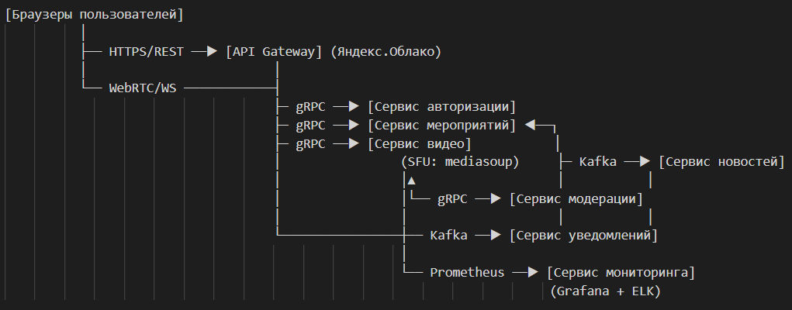

## 1. Сервисы системы

На основе ФТ/НФТ из HW1 выделяем 7 ключевых сервисов:

1. Сервис авторизации

    * Регистрация/вход через SSO (университетские аккаунты)

    * Управление ролями (студент/модератор)

2. Сервис мероприятий

    * Создание мероприятий, управление расписанием

    * Набор участников, привязка к новостям

3. Сервис видео

    * WebRTC-видеочаты (1:1, группы до 10 чел.)

    * Трансляции "Общего зала" через CDN

    * Интеграция с SFU-серверами

4. Сервис модерации

    * Мониторинг видеочатов в реальном времени

    * Отправка предупреждений, управление очередью выступлений

5. Сервис новостей

    * Генерация "мировых событий"

    * Распространение новостей по мероприятиям

6. Сервис уведомлений

    * Уведомления о событиях (email/push)

    * Оповещения от модераторов

7. Сервис мониторинга

    * Сбор метрик (Prometheus/Grafana)

    * Логирование действий (ELK Stack)

## 2. Интеграции между сервисами

Сервис A|   Сервис B|   Данные/Событие| Тип коммуникации|   Обоснование
---|---|---|---|---
API Gateway|    Сервис авторизации|   Проверка JWT токена|    Синхронный (gRPC)|  Минимальная задержка для авторизации запросов
Сервис авторизации|   Сервис мероприятий|  Данные пользователя|    Синхронный (gRPC)|  Актуальные данные при регистрации на мероприятие
Сервис мероприятий|  Сервис новостей|   "Создано мероприятие X"|    Асинхронный (Kafka)|    Гарантированная доставка при высокой нагрузке
Сервис мероприятий|  Сервис видео|  "Старт мероприятия"|    Синхронный (gRPC)|  Немедленная активация видео-сервисов
Сервис видео|  Сервис модерации| "Чат X начал работу"|   Асинхронный (Kafka)|    Нетребовательно к реальному времени
Сервис модерации| Сервис видео|  "Подключи модератора к чату Y"| Синхронный (gRPC)|  Критично низкая задержка (<100 мс)
Сервис новостей|   Сервис уведомлений|   "Новое событие в мероприятии Z"|    Асинхронный (Kafka)|    Уведомления не требуют мгновенной доставки
Сервис модерации| Сервис уведомлений|   "Пользователь W получил предупреждение"|    Асинхронный (Kafka) Отказоустойчивость при пиках нагрузки
Сервис видео|  Сервис мониторинга| Метрики CPU/трафика|    Push (Prometheus)|  Стандартный подход для метрик
Браузер клиента|    Сервис видео|  Видеопотоки, управление|    WebRTC/WebSockets|  Низкая задержка для видео

## 3. Инфраструктура

* gRPC для синхронных вызовов. Минимальная задержка (важно для видео и модерации). Поддержка в Яндекс.Облаке.

* Apache Kafka для асинхронных событий. Гарантированная доставка, буферизация пиков нагрузки. Локализованная версия в РФ (Tarantool Queue как альтернатива).

* WebRTC/WebSockets для клиент-сервера. Низкая задержка видео, поддержка в браузерах без плагинов.

* Prometheus Push Gateway. Стандарт для мониторинга, интеграция с Grafana в Яндекс.Облаке.

## 4. High-Level Design схема

Ключевые интеграции:
- Российский CDN для "Общего зала" (подключен к Video Service)
- Все сервисы развёрнуты в Яндекс.Облаке (зона РФ)
- Данные хранятся в PostgreSQL (основное) + Redis (кэш)

Особенности реализации: 

* Трафик разделён на 2 потока:

    * Управляющие запросы → API Gateway

    * Видеоданные → Прямо в Video Service через WebRTC

* Централизация управления:

    * Event Service выступает "оркестратором" мероприятий

    * Все события дублируются в Monitoring Service для SLA 99.9%

* Безопасность (ФЗ-152):

    * Все коммуникации через TLS 1.3+

    * Аутентификация по JWT с ГОСТ-шифрованием

    * Логи хранятся 6 месяцев (требование Роскомнадзора)

* Масштабирование:

    * Горизонтальное масштабирование Video Service (SFU-кластер)

    * Kafka-партиции по event_id для параллельной обработки

    * Автоскейлинг в Яндекс.Облаке по CPU/трафику
