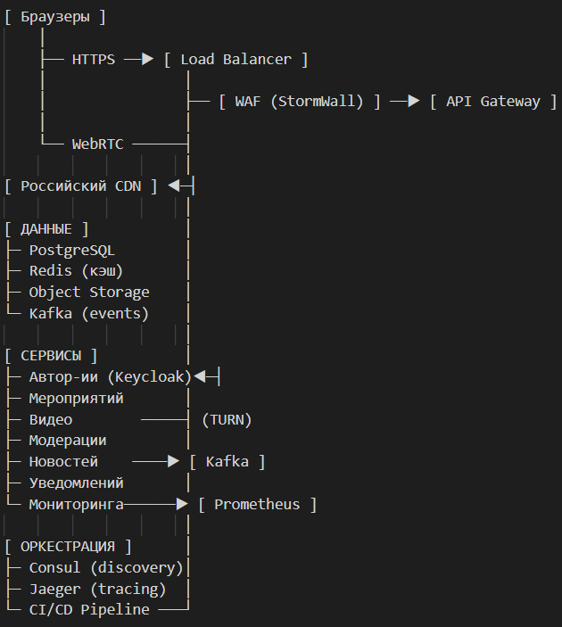

## Дано

Your Architectural Kata is...

Mock Internet UN

Organization running "Mock UN" events wants to take its events online, permitting students to participate online

Requirements: student-diplomats must be able to video-chat with one another; student-diplomats must be able to "give speeches" to the 
"assembly" (video-chat to the entire group); (mocked) world events (created by moderators) distributed via (mock) "news sites"; 
moderators must be able to monitor any video chat for appropriateness

Users: 500 or so "diplomats" per "mock UN" gathering; dozens of moderators per "mock UN"; many "mock UN"s simultaneously; no new 
hardware requirements on students

## 1. Обязательные компоненты (MUST)

Компонент|	Обоснование|	Реализация
--|--|--
Load Balancer|	Распределение HTTP/WebSocket трафика между инстансами. Без него невозможно обслужить 500+ участников на мероприятие	|Yandex Application Load Balancer (с поддержкой WebSockets)
Российский CDN|	Доставка видео "Общего зала" с edge-узлов. Требование низкой задержки (<200 мс)|	Yandex CDN или SberCDN
Кэш сессий|	Уменьшение нагрузки на БД для данных авторизации и активных сессий|	Redis Cluster (3 ноды)
WAF|	Защита от OWASP Top 10. Требование Роскомнадзора для образовательных платформ|	StormWall (российский аналог Cloudflare WAF)
IdP (Identity Provider)|	Централизованная аутентификация через университетские SSO. Без нее невозможна интеграция с вузами|	Keycloak с ГОСТ-аутентификацией
CI/CD Pipeline|	Автоматизация развертывания. Критично для 100+ мероприятий в месяц|	Яндекс CI/CD + GitLab
Система мониторинга|	Выполнение SLA 99.9%. Требует сбора метрик со всех компонентов|	Prometheus + Grafana + Yandex Monitoring
Резервное копирование|	Требование ФЗ-152 (хранение ПДн). RPO < 5 мин|	Daily snapshots + WAL-G + Yandex Object Storage

## 2. Рекомендуемые компоненты (SHOULD)

Компонент|	Обоснование|	Реализация
--|--|--
API Gateway|	Единая точка входа для управления API. Упрощает security policies и rate limiting|	Yandex API Gateway
Message Broker|	Гарантированная доставка событий между сервисами. Особенно важно для новостей и уведомлений|	Apache Kafka
Service Discovery|	Автоматическое обнаружение сервисов при масштабировании. Упрощает оркестрацию|	Consul
Distributed Tracing| Диагностика проблем в микросервисной архитектуре. Требование для SLA 99.9%|	Jaeger + OpenTelemetry
Object Storage|	Хранение записей трансляций и медиаконтента. Альтернатива NAS|	Yandex Object Storage
TURN-сервер|	Обход NAT для P2P-видеочатов. Критично для корпоративных сетей университетов|	Coturn с GEO-распределением

## 3. Обновленная схема HLD

